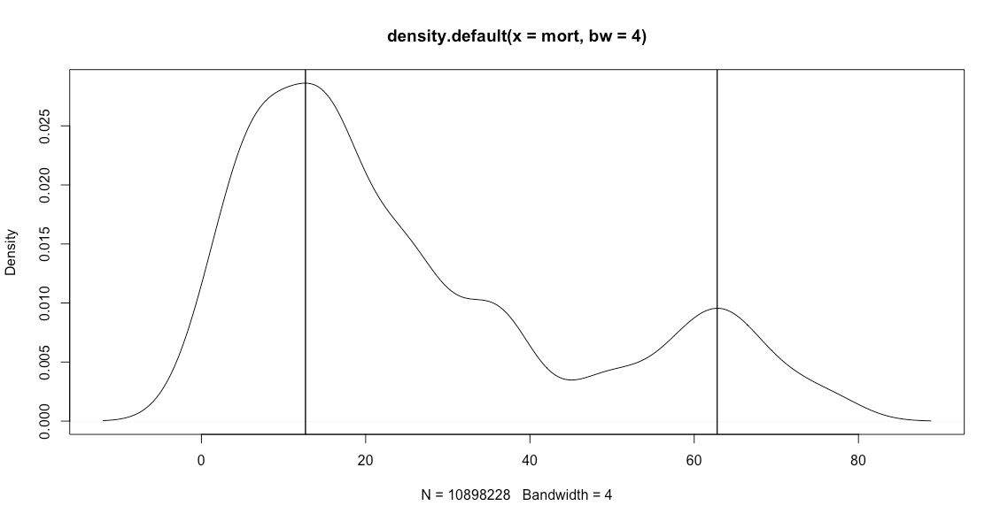
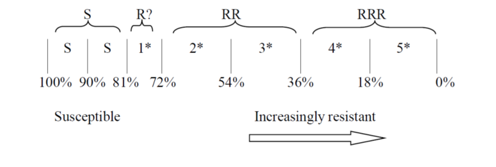

## Load packages
```{r packages, message = FALSE}
rm(list=ls())
library(tidyverse) # for easy data manipulation; includes dplyr, ggplot & more
library(readxl) # for reading in Excel workbooks / spreadsheets
```

## Load data
```{r data}
ab_res <- read.csv("../data/ab_res_Atl-Cyc.csv", header = TRUE)
cereal <- read_xlsx("../data/England_crop_areas.xlsx",1)# sheet 1 is 2021 data, sheet 2 is 2016 data
```

```ab_res``` is a dataframe of average resistance across several herbicides. I calculated average resistance to two herbicides, Atlantis and cycloxydim. We did not include resistance to fenoxaprop - its inclusion lead to high resistance scores because Rothamsted (David Comont and Richard Hull) found almost universal resistance to that active. However, this isn't necessarily because there *is* universal resistance to fenoxaprop; their findings may be in part because they could only include fields in the resistance assays for which they were able to get seeds, i.e. fields with enough surviving black-grass at maturity. Some of the more Northerly fields did not have enough black-grass to collect seeds from - perhaps because it was susceptible and so was still being controlled relatively well by herbicides.So in this analysis we only use average resistance to Atlantis and cycloxydim, and do not include fenoxaprop.

```cereal``` contains DEFRA data on the area of cereals grown in each English local authority. The original data is in the spreadsheet "structure-june-eng-localauthority-09jan18_2022-01-28.xlsx" in the [data/DEFRA/](https://github.com/alexavarah/Resistance_Management/tree/main/data/DEFRA) folder, and came from [gov.uk statistics](https://www.gov.uk/government/statistical-data-sets/structure-of-the-agricultural-industry-in-england-and-the-uk-at-june). Scroll down to the section called 'English geographical breakdowns' and click on 'local authority' to download the Excel file.  

## Clean density-resistance data
Resolve the fact that there two variations of a county name: Buckingham and Buckinghamshire. Change Buckingham to Buckinghamshire.  
```{r resolve-Buckingham}
ab_res <- ab_res %>% 
  # first change all instances of Buckinghamshire to Buckingham (otherwise, searching for Buckingham and replacing it with Buckinghamshire would also replace all the 'Buckingham's within the 'Buckinghamshire's)
  mutate(county = str_replace(county, "Buckinghamshire", "Buckingham")) %>% 
  mutate(county = str_replace(county, "Buckingham", "Buckinghamshire")) 
```

There are also some mistakes with the counties given in the data. Counties were ascertained by entering each farm's postcode into a [UK postcode checker](https://www.streetlist.co.uk/). Here are the ones that are wrong:  
* MK16_0HR = Buckinghamshire (given as Bedfordshire)  
* SG19_3BP = Cambridgeshire (given as Bedfordshire)  
* OX17_1QB = Oxfordshire (given as Northamptonshire)  
* OX17_1AS = Oxfordshire (given as Warwickshire)  
* LE12_6JD = Nottinghamshire (given as Leicestershire)  
* LE16_7UG = Leicestershire (given as Northamptonshire)
* LE16_8TB = Leicestershire (given as Northamptonshire)

```{r correct-counties}
ab_res <- ab_res %>% 
  mutate(county = replace(county, postcode == "MK16_0HR", "Buckinghamshire"),
         county = replace(county, postcode == "SG19_3BP", "Cambridgeshire"),
         county = replace(county, postcode == "OX17_1QB", "Oxfordshire"),
         county = replace(county, postcode == "OX17_1AS", "Oxfordshire"),
         county = replace(county, postcode == "LE12_6JD", "Nottinghamshire"),
         county = replace(county, postcode == "LE16_7UG", "Leicestershire"),
         county = replace(county, postcode == "LE16_8TB", "Leicestershire")
         ) 
```

## Summary stats on counties & regions
Count the number of fields per county.
```{r fields-per-county}
ab_res %>% 
  group_by(county) %>% 
  tally()
```
  
How may fields in total in the mapped data set?  
```{r}
ab_res %>% 
  tally()
```
  
List of counties in the data:
```{r which-counties-are-in-data}
levels(as.factor(ab_res$county))
```
13 counties.  

## Assign regions
Eventually we want to know the proportions of each den-res state by broad geographic region, so assign each county to either *north*, *central* or *east* based on DEFRA regions. Counties in the East of England = east; counties in the West and East Midlands = central; counties containing Yorks* = north.  
```{r assign-counties-to-regions}
ab_res <- ab_res %>% 
  mutate(region = fct_recode(county, 
                             "east" = "Bedfordshire",
                             "central" = "Buckinghamshire",
                             "east" = "Cambridgeshire",
                             "north" = "East Riding of Yorkshire",
                             "east" = "Lincolnshire",
                             "east" = "Norfolk",
                             "north" = "North Yorkshire",
                             "central" = "Leicestershire",
                             "central" = "Northamptonshire",
                             "central" = "Nottinghamshire",
                             "central" = "Oxfordshire" ,
                             "north" = "South Yorks",
                             "central" = "Warwickshire" 
                             )
         )
```

How many fields are there are per county?  
```{r fields-per-region}
ab_res %>% 
  group_by(region, county) %>% 
  tally()
```

How many fields are there are per region?  
```{r fields-per-region}
ab_res %>% 
  group_by(region) %>% 
  tally()
```


# Work out den-res proportions by region
## Choose cut-offs  
First, we need to work out what the cut-off points will be for the 'high' vs 'low' density and resistance categories.  

### **Density**
**Option 1**  
One option is to separate density into *high* and *low* categories by applying a cut-off to the mean density states. 

The density data was collected using categories *absent*, *low*, *medium*, *high* and *very high*. These were then converted to ordinal density states (0,1,2,3,4).
We could therefore use the following cut-offs:  
* absent / low / medium = 0 - 2.49  
* high / very high = 2.5 and above  

However, choosing cut-offs in this way is not ideal because the raw density data is ordinal. The mean density state of each field was estimated by multiplying the number of quadrats in each density state by the ordinal value for that state, and then dividing by the total number of quadrats. Here is field *chivers.top.left* as an example:   

```{r calculating-mean-density}
# NB ordinal density states were set as 1-5 and then converted back to 0-4 by subtracting 1
( ((2*1)+(91*2)+(26*3)+(37*4)+(8*5)) / (2+91+26+37+8) ) -1 
```
So the mean density state of a field is not an ordinal number but an integer, and we are therefore required to choose a cut-off to represent the limit between medium and high density. The obvious cut-off is 2.5 but we could also chose other values. We'd rather remove the element of choice.  

**Option 2**  
Another way of doing it would be to work out the proportion of *high/very high* density states in a field and assign high density to any field with 50% or more grid squares in *high* and *very high* density states. We use a similar approach elsewhere in the analysis, for example where we look at the effect of scenario on the proportion of the field with high or very high densities at the end of the rotation. Rationale is that high and very high densities affect yield, whereas the other density states don't.  

Try both options to see what difference it makes. Option 1 gives ```den1``` and Option 2 gives ```den2```.  
```{r test-both-density-assignment-options}
test <- ab_res %>% 
  mutate(prop_hv = (h + v) / (a + l + m + h + v), #calculate proportion of high & very high density quadrats in a field
         den1 = if_else(den_mean >= 2.5, 'H', 'L'), #assign H or L density using Option 1
         den2 = if_else(prop_hv >= 0.5, 'H', 'L') #assign H or L density using Option 2
         )
```

A look at ```test``` shows that:  
```{r look-at-test}
test %>% 
  filter(!den1==den2) %>% # get rows where den1 and den2 aren't the same
  dplyr::select(population, field, den1, den2) #pull out columns we are interested in
```

* there are 2 fields where ```den2``` is H and ```den1``` is L  
* there is 1 field where ```den1``` is H and ```den2``` is L   
So there is almost no difference in the two methods.  

<span style="color: blue;">As there's almost no difference we're going to go with Option 2 as it doesn't involve choosing a cut-off between medium and high density states.</span>  

**Option 3**  
To get a finer division of density states (to retain L, M, H, V), split using the original ordinal density states.  
* A&L: 0 - <1.5  
* M: >=1.5 - <2.5  
* H: >=2.5 - <3.5  
* V: >=3.5 

### **Resistance**
For resistance, we could use the distribution from Rob G's simulations (Figure 1):
  
<font size="2">**Figure 1.** Distribution of resistance. x axis shows % mortality.</font>  

This suggests using a cut-off of ~45% mortality/ 55% survival, where high resistance is <45% mortality (or >55% survival).  

Alternatively (probably better) we could use the WRAG guidelines (Figure 2, and see 'The ‘R’ system for interpreting results from herbicide-resistance screening assays in the UK'). They have developed a standard ‘R’ system, and this has been adopted by all resistance testing centres in the UK. There's a choice of which cut-off to use. Either the cut-off at 72% mortality / 28% survival between 'probably susceptible' and 'definite resistance present'; or a cut-off at 54% mortality / 46% survival which is the mid point of the RR category, separating 2* and 3* resistance.  


<font size="2">**Figure 2.** The older ‘star’ rating and newer ‘R’ rating systems used in the United Kingdom for designating different degrees of resistance based on responses to single doses of herbicides in resistance screening assays (Moss et al. 1999). **S** = susceptible; **R?** = early indications that resistance may be developing, possibly reducing herbicide performance; **RR** = resistance confirmed, probably reducing herbicide performance; **RRR** = resistance confirmed, highly likely to reduce herbicide performance.</font>  

## Assign the new H and L categories
Now assign high (H) or low (L) density (D) and resistance (R) states to each field.  

Using 28% survival.  
```{r assign-high-or-low-28}
ab_res_28 <- ab_res %>% 
  mutate(prop_hv = (h + v) / (a + l + m + h + v),
         D = if_else(prop_hv >= 0.5, 'HD', 'LD'),
         R = if_else(surv_mean > 0.28, 'HR', 'LR'),
         denres = paste(D, R, sep = "-"),
         denres = as.factor(denres))
```

Using 28% survival and finest resolution density states.
```{r}
ab_res_28_6DR <- ab_res %>% 
  mutate(prop_hv = (h + v) / (a + l + m + h + v),
         D = case_when(den_mean >= 3.5 ~ 'VD',
                       den_mean >= 2.5 & prop_hv < 3.5 ~ 'HD',
                       den_mean >= 1.5 & prop_hv < 2.5 ~ 'MD',
                       den_mean >= 0.00 & prop_hv < 1.5 ~ 'LD',),
         R = if_else(surv_mean > 0.28, 'HR', 'LR'),
         denres = paste(D, R, sep = "-"),
         denres = as.factor(denres)) 

levels(ab_res_28_6DR$denres)

```
Re-order levels
```{r}
ab_res_28_6DR<- ab_res_28_6DR %>% 
  mutate(denres = factor(denres,
                         levels = c("LD-LR", "MD-LR",
                                    "LD-HR", "MD-HR",
                                    "HD-HR", "VD-HR")))
levels(ab_res_28_6DR$denres)
```
Good, no HD-LR present.

Using 46% survival.  
```{r assign-high-or-low-46}
ab_res_46 <- ab_res %>% 
  mutate(prop_hv = (h + v) / (a + l + m + h + v),
         D = if_else(prop_hv >= 0.5, 'HD', 'LD'),
         R = if_else(surv_mean > 0.46, 'HR', 'LR'),
         denres = paste(D, R, sep = "-"),
         denres = as.factor(denres))
```

Using 55% survival.  
```{r assign-high-or-low-55}
ab_res_55 <- ab_res %>% 
  mutate(prop_hv = (h + v) / (a + l + m + h + v),
         D = if_else(prop_hv >= 0.5, 'HD', 'LD'),
         R = if_else(surv_mean >=0.55, 'HR', 'LR'),
         denres = paste(D, R, sep = "-"),
         denres = as.factor(denres))
```

### What are the total numbers of each density-resistance state?  

**Using 28% survival.** 
```{r total-for-each-denres-state-28, echo=FALSE}
ab_res_28 %>% 
  dplyr::summarize(
    `LD-LR` = length(field[denres=='LD-LR']),
    `HD-LR` = length(field[denres=='HD-LR']),
    `LD-HR` = length(field[denres=='LD-HR']),
    `HD-HR` = length(field[denres=='HD-HR'])
    )
```
  
```{r}
ab_res_28_6DR %>% 
  dplyr::summarize(
    `LD-LR` = length(field[denres=='LD-LR']),
    `MD-LR` = length(field[denres=='MD-LR']),
    `LD-HR` = length(field[denres=='LD-HR']),
    `MD-HR` = length(field[denres=='MD-HR']),
    `HD-LR` = length(field[denres=='HD-LR']),#not in data
    `VD-LR` = length(field[denres=='VD-LR']),#not in data
    `HD-HR` = length(field[denres=='HD-HR']),
    `VD-HR` = length(field[denres=='VD-HR'])
    )
```


**Using 46% survival.**  
```{r total-for-each-denres-state-46, echo=FALSE}
ab_res_46 %>% 
  dplyr::summarize(
    `LD-LR` = length(field[denres=='LD-LR']),
    `HD-LR` = length(field[denres=='HD-LR']),
    `LD-HR` = length(field[denres=='LD-HR']),
    `HD-HR` = length(field[denres=='HD-HR'])
    )
```
  
**Using 55% survival.** 
```{r total-for-each-denres-state-55, echo=FALSE}
ab_res_55 %>% 
  dplyr::summarize(
    `LD-LR` = length(field[denres=='LD-LR']),
    `HD-LR` = length(field[denres=='HD-LR']),
    `LD-HR` = length(field[denres=='LD-HR']),
    `HD-HR` = length(field[denres=='HD-HR'])
    )
```
Using a cut-off of 55% survival gives an 'HD-LR' category field, which would be odd as it would occur due to poor management. This cut-off is too high.  

## Calculate proportions of each den-res state by region
Work out the proportions of each density and resistance state for each region.  

**Using 28% survival:**   
```{r denres-by-region-28, echo=FALSE}
denres_states_by_region_28 <- ab_res_28 %>% 
  dplyr::group_by(region) %>% 
  dplyr::summarise(
    LDLR = length(field[denres=='LD-LR']),
    LDHR = length(field[denres=='LD-HR']),
    HDHR = length(field[denres=='HD-HR']),
    total = length(field)
  ) %>% 
  dplyr::mutate(prop_LDLR = LDLR/total,
                prop_LDHR = LDHR/total,
                prop_HDHR = HDHR/total,
                survival_cutoff = 28)

denres_states_by_region_28
```
This shows the north and east have more fields with low resistance than the central region, which is what we expect.  

Do it again for the finer density resolution:
```{r denres-by-region-28-6DR, echo=FALSE}
DR_by_region_28_6DR <- ab_res_28_6DR %>% 
  dplyr::group_by(region) %>% 
  dplyr::summarise(
    LDLR = length(field[denres=='LD-LR']),
    MDLR = length(field[denres=='MD-LR']),
    LDHR = length(field[denres=='LD-HR']),
    MDHR = length(field[denres=='MD-HR']),
    HDLR = length(field[denres=='HD-LR']),#not in data
    VDLR = length(field[denres=='VD-LR']),#not in data
    HDHR = length(field[denres=='HD-HR']),
    VDHR = length(field[denres=='VD-HR']),
    total = length(field)
  ) %>% 
  dplyr::mutate(prop_LDLR = LDLR/total,
                prop_MDLR = MDLR/total,
                prop_LDHR = LDHR/total,
                prop_MDHR = MDHR/total,
                prop_HDHR = HDHR/total,
                prop_VDHR = VDHR/total,
                survival_cutoff = 28)

DR_by_region_28_6DR
```

**Using 46% survival:**  
```{r denres-by-region-46, echo=FALSE}
denres_states_by_region_46 <- ab_res_46 %>% 
  dplyr::group_by(region) %>% 
  dplyr::summarise(
    LDLR = length(field[denres=='LD-LR']),
    LDHR = length(field[denres=='LD-HR']),
    HDHR = length(field[denres=='HD-HR']),
    total = length(field)
  ) %>% 
  dplyr::mutate(prop_LDLR = LDLR/total,
                prop_LDHR = LDHR/total,
                prop_HDHR = HDHR/total,
                survival_cutoff = 46)

denres_states_by_region_46
```
This gives a very similar breakdown to using a cut-off of 28% survival.  

**Using 55% survival:**  
```{r denres-by-region-55, echo=FALSE}
denres_states_by_region_55 <- ab_res_55 %>% 
  dplyr::group_by(region) %>% 
  dplyr::summarise(
    LDLR = length(field[denres=='LD-LR']),
    LDHR = length(field[denres=='LD-HR']),
    HDHR = length(field[denres=='HD-HR']),
    total = length(field)
  ) %>% 
  dplyr::mutate(prop_LDLR = LDLR/total,
                prop_LDHR = LDHR/total,
                prop_HDHR = HDHR/total,
                survival_cutoff = 55)

denres_states_by_region_55
```
This cut-off affects the worst (HD-HR) category, whereas the other two cut-offs don't differ in their effect on the proportions in the HD-HR category. 55% survival is probably too high a cut-off.  

<span style="color: blue;">We're going to set the cut-off at 28% survival, using the WRAG cut-off between 'probably susceptible' and 'definite resistance present'.</span> This means that the low resistance category includes 'susceptible' (S) and 'probably susceptible' (R?) categories, and the high resistance category includes 'definite resistance present' (RR) and above.  
  
### What proportion of our farms are in each density-resistance state?  

**Using 28% survival.** 
```{r proportion-in-each-denres-state-28, echo=FALSE}
ab_res_28 %>% 
  dplyr::summarize(
    `LD-LR` = (length(field[denres=='LD-LR'])/length(field))*100,
    `LD-HR` = (length(field[denres=='LD-HR'])/length(field))*100,
    `HD-HR` = (length(field[denres=='HD-HR'])/length(field))*100
    )
```
  
## Potential sensitivity analyses
We could run sensitivity analyses using cut-offs either side of the 28% survival chosen here. For example we could use 19% survival (limit between S and R?) and 46% survival (boundary within RR category separating 2* and 3* resistance).
  
Keep the results of all three cut-offs in one data frame so that we can easily choose which proportions we want to use in the scaling-up, or run sensitivity analyses.  
```{r make-final-df, echo=FALSE}
regional_denres <- rbind(denres_states_by_region_28, 
                         denres_states_by_region_46, 
                         denres_states_by_region_55)

write.csv(regional_denres,"../output/denres_by_region_AC-all_cutoffs.csv", row.names = FALSE)
```

# Work out cereals area per region
Now, using the county-level crop areas from DEFRA (the ```cereals``` data frame), work out the area of cereals grown in each region. Remove Berkshire from this data frame as actually we have no fields there.   
```{r calculate-cereal-area-by-region}
cereal_filtered <- cereal %>% 
  filter(!my_counties %in% "Berkshire") %>%  
  # assign regions to this data
  mutate(region = fct_recode(my_counties, 
                             "east" = "Bedfordshire",
                             "central" = "Buckinghamshire",
                             "east" = "Cambridgeshire",
                             "north" = "East Riding of Yorkshire",
                             "east" = "Lincolnshire",
                             "east" = "Norfolk",
                             "north" = "North Yorkshire",
                             "central" = "Leicestershire",
                             "central" = "Northamptonshire",
                             "central" = "Nottinghamshire",
                             "central" = "Oxfordshire" ,
                             "north" = "South Yorkshire",
                             "central" = "Warwickshire" 
                             )
         ) 
```
  
What's the area of cereals per region?
```{r}
cereal_filtered %>% 
  dplyr::group_by(region) %>%
  dplyr::summarise(regional_cereal_area = sum(cereals_area_2021_ha))
```


What's the area of cereals for each county?
```{r}
cereal_filtered %>% 
  dplyr::group_by(my_counties) %>%
  dplyr::summarise(county_cereal_area = sum(cereals_area_2021_ha))
```


Now work out the cereal area in each of the initial density-resistance states. To do this, add the cereal area onto the ```regional_denres``` data frame and then work out the proportional area.  

First, convert ```regional_denres``` from wide to long (just use the rows resulting from the 28% survival cut-off).
```{r wide-to-long}
# N.B. region must be a factor for this code to work (it already is)
reg_prop_DR <- regional_denres %>% 
  dplyr::filter(survival_cutoff==28) %>% 
  dplyr::select(-c(LDLR:total,survival_cutoff)) %>% 
  gather(initDR, propDR, prop_LDLR:prop_HDHR, factor_key = TRUE ) %>% 
  dplyr::mutate(initDR = gsub('prop_', '', initDR)) # remove the string 'prop_'
```

Now join the regional cereal areas onto this.  
```{r join-and-calculate-LA-areas}
cereal_by_LA <- dplyr::inner_join(reg_prop_DR, cereal_filtered, by = "region", relationship = 'many-to-many') %>% 
  # work out cereal area by local authority for each den-res state
  dplyr::mutate(cereal_area_in_denres_state = cereals_area_2021_ha*propDR) %>% 
  dplyr::arrange(region)
```

Save this file so I can use it to do the scaling-up.  
```{r}
write.csv(cereal_by_LA, 
          "../output/cerealarea_by_localauthority_and_denres_3DR_2021.csv", 
          row.names = FALSE)
```

Do it again with the finer-resolution density categories (6 density-resistance categories).
```{r}
# region must be a factor for this code to work (it already is)
reg_prop_DR_6DR <- DR_by_region_28_6DR %>% 
  dplyr::select(-c(LDLR:total,survival_cutoff)) %>% 
  tidyr::gather(initDR, propDR, prop_LDLR:prop_VDHR, factor_key = TRUE ) %>% 
  dplyr::mutate(initDR = gsub('prop_', '', initDR)) %>% # remove the string 'prop_'
  dplyr::arrange(region)
```

Now join the regional cereal areas onto this.  
```{r calculate-LA-areas-6DR}
cereal_by_LA_6DR <- dplyr::inner_join(reg_prop_DR_6DR, cereal_filtered, 
                                          by = "region", relationship = 'many-to-many') %>% 
  # work out cereal area by local authority for each den-res state
  dplyr::mutate(cereal_area_in_denres_state = cereals_area_2021_ha*propDR) %>% 
  dplyr::arrange(region)
```

Save these files so I can use them to do the scaling-up.  
```{r}
write.csv(cereal_by_LA_6DR, 
          "../output/cerealarea_by_localauthority_and_denres_6DR_2021.csv", 
          row.names = FALSE)
```
  
Work out den-res areas per region.
```{r}
cereal_by_LA %>% 
  group_by(region, initDR) %>% 
  dplyr::mutate(cereal_area_tot = sum(cereal_area_in_denres_state)) %>% 
  dplyr::select(region, initDR, cereal_area_tot) %>% 
  distinct(region, initDR, .keep_all = TRUE)
```


```{r, echo=FALSE, message=FALSE, warning=FALSE}
rm(#ab_res,
   ab_res_28,
   ab_res_46, 
   ab_res_55, 
   denres_states_by_region_28,
   denres_states_by_region_46, 
   denres_states_by_region_55,
   test)
```

